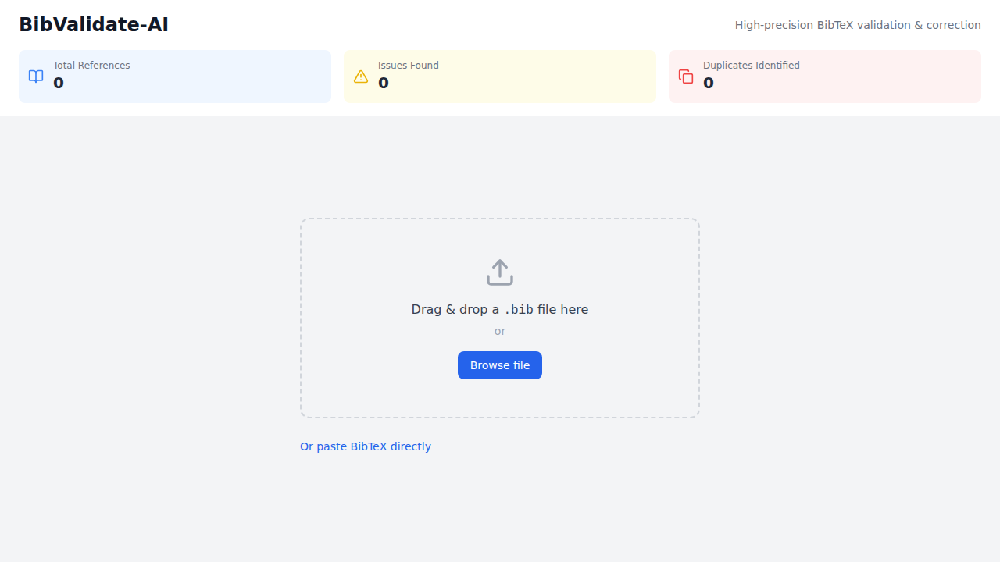
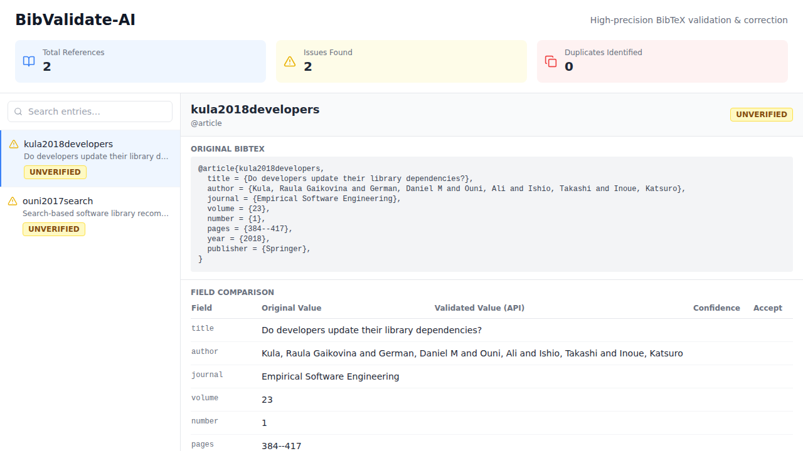
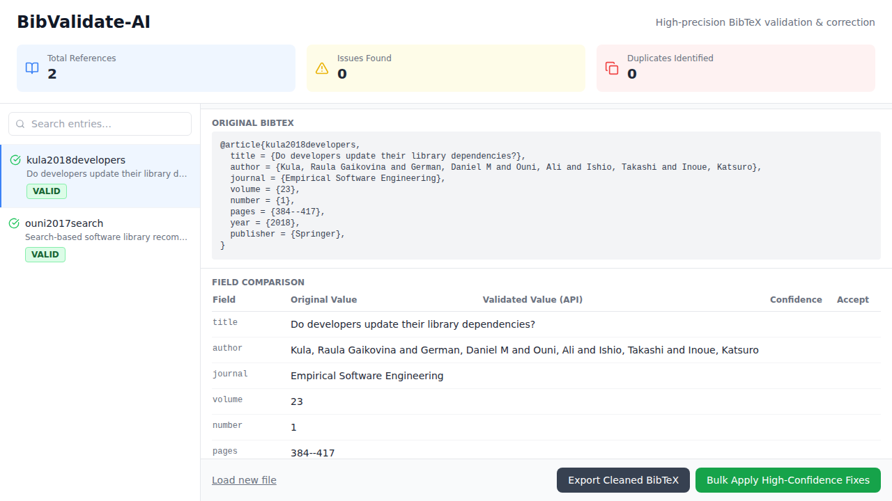

# BIB-Check (BibValidate-AI)

High-precision BibTeX validation and correction tool that validates, cross-references, and fixes BibTeX bibliography entries by interfacing with external academic databases.

## Features

- **BibTeX Parsing** — Upload `.bib` files or paste BibTeX text directly
- **Cross-Reference Validation** — Validate entries against ArXiv, DBLP, and Google Scholar
- **Duplicate Detection** — Fuzzy string matching to flag potential duplicate entries (>85% title similarity)
- **Field Suggestions** — Side-by-side comparison of original vs. validated values with confidence scores
- **Bulk Fixes** — Auto-apply high-confidence corrections (>95% confidence) or accept individually
- **Export** — Download a cleaned `.bib` file with applied fixes

## Screenshots

### Upload Screen
Drag & drop a `.bib` file or paste BibTeX text directly.



### Parsed Entries
Browse parsed entries with field-level details and original BibTeX preview.



### Validated Results
Entries validated against external APIs showing VALID, FIXED, UNVERIFIED, or DUPLICATE status.



## Tech Stack

| Component | Technology |
|-----------|------------|
| Backend | Python 3.10+, FastAPI |
| Frontend | React 19, Vite, TypeScript, TailwindCSS |
| BibTeX Parsing | bibtexparser v2 |
| Fuzzy Matching | RapidFuzz |
| External APIs | ArXiv, DBLP, Google Scholar |

## Installation

### Prerequisites

- **Python 3.10+**
- **Node.js 18+** and **npm**

### Backend

```bash
cd backend

# Create and activate a virtual environment
python -m venv venv
source venv/bin/activate        # On Windows: venv\Scripts\activate

# Install dependencies
pip install -r requirements.txt
```

### Frontend

```bash
cd frontend

# Install dependencies
npm install
```

## Running the Application

You need to run both the backend and frontend servers.

### Start the Backend

```bash
# From the project root
source backend/venv/bin/activate   # On Windows: backend\venv\Scripts\activate

# Option 1 – use the entry-point script (recommended, avoids multiprocessing issues on macOS/Windows)
python run.py

# Option 2 – invoke uvicorn directly
uvicorn backend.main:app --reload --port 8000
```

The API will be available at `http://localhost:8000`. You can verify it's running by visiting `http://localhost:8000/health`.

### Start the Frontend

```bash
# In a separate terminal, from the project root
cd frontend
npm run dev
```

The UI will be available at `http://localhost:5173`.

> **Tip:** To point the frontend at a different backend URL, set the `VITE_API_URL` environment variable before starting the dev server (defaults to `http://localhost:8000`).

## Usage

1. **Upload** — Drag & drop a `.bib` file onto the upload area, or click "Or paste BibTeX directly" to enter BibTeX text manually.
2. **Review** — Browse parsed entries in the sidebar. Select an entry to see its fields and original BibTeX.
3. **Validate** — Click **Validate via API** to cross-reference entries against ArXiv and DBLP. Entries are marked as VALID, FIXED, UNVERIFIED, or DUPLICATE.
4. **Accept Suggestions** — Review suggested corrections in the Field Comparison table and accept them individually, or click **Bulk Apply High-Confidence Fixes** to auto-apply all suggestions above the 95% confidence threshold.
5. **Export** — Click **Export Cleaned BibTeX** to download the corrected bibliography file.

## Running Tests

```bash
# Install dev dependencies
pip install -r backend/requirements-dev.txt

# Run backend tests from the project root
pytest
```

## License

This project is licensed under the [MIT License](LICENSE).
